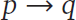
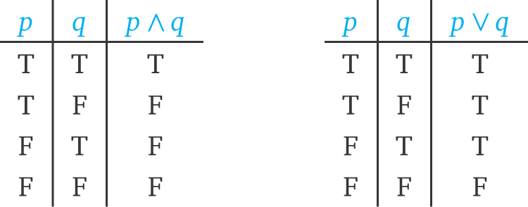
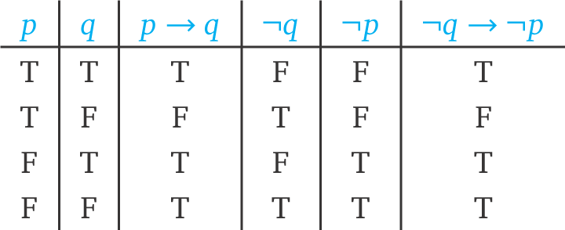
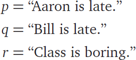
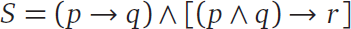
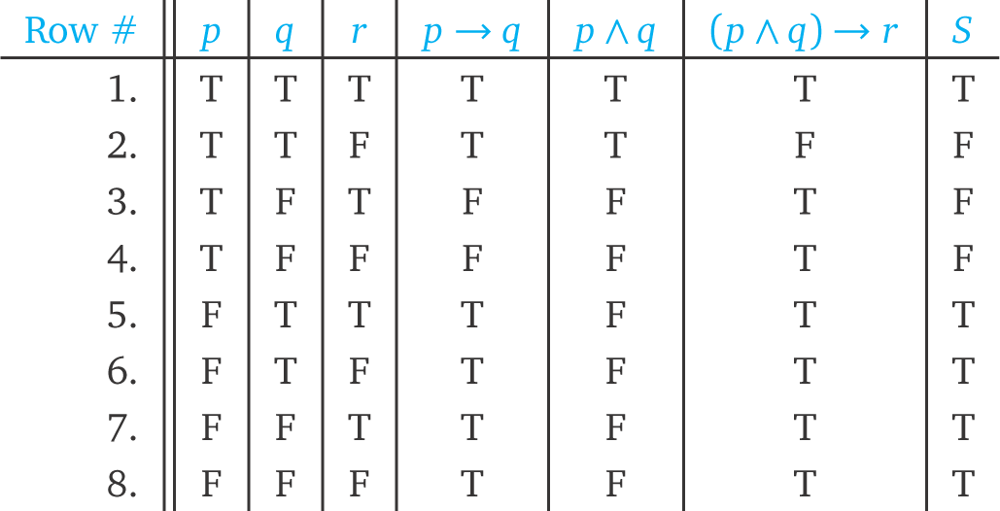
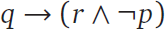

1.1 Formal Logic
----------------

Notation is an important part of mathematical language. Mathematicians’
chalkboards are often filled with an assortment of strange characters and
symbols; such a display can be intimidating to the novice, but there’s a good
reason for communicating this way. Often the act of reducing a problem to
symbolic language helps us see what is really going on. Instead of operating in
the fuzzy world of prose, we translate a problem to notation and then perform
well-defined symbolic manipulations on that notation. This is the essence of
the powerful tool called formalism. In this section, we explore how a formal
approach to logic can help us avoid errors in reasoning.

A note on terminology: we’ll use the word formal to describe a process that
relies on manipulating notation. Often people use this word to mean “rigorous,”
but that’s not our intention. A formal argument can be rigorous, but so can an
argument that does not rely on symbols.

One nice feature of formalism is that it allows you to work without having to
think about what all the symbols mean. In this sense, formal logic is really
“logical not-thinking.” Why is this an advantage? Formal calculations are less
prone to error. You are already familiar with this phenomenon: much of the
arithmetic you learned in school was formal. You have a well-defined symbolic
algorithm for multiplying numbers using pencil and paper, and you can quite
effectively multiply three-digit numbers without thinking much about what you
are really doing. Of course, formalism is pointless if you don’t know what you
are doing; at the end of any formal calculation, it is important to be able to
interpret the results.

1.1.1 Inquiry Problems
``````````````````````

The following three inquiry problems are designed to help you begin thinking
about the ideas in this section. You should attempt these problems before
reading further. Ideally, you should also discuss your answers with your
classmates. You will find inquiry problems scattered throughout the text. When
you encounter them, keep in mind that they are open-ended problems that will
often introduce unfamiliar concepts. To get the most out of these inquiry
problems, spend some time thinking about them on your own, write down
preliminary solutions, and then share your thoughts, conclusions, and questions
with others.
Inquiry 1.1 Westley, standing with his hands behind his back, claims that he is
holding a quarter in his left hand and a $20 bill in his right hand. You
believe he is lying. What would you have to show to demonstrate that he is
lying? Invent a diagram, chart, or symbols to illustrate all the possible
scenarios.
Inquiry 1.2 Buttercup knows whether or not Westley is lying. She promises that
if Westley is lying, she will give you a cookie. Buttercup always keeps her
promises. Suppose she does not give you a cookie; what can you conclude?
Suppose she gives you a cookie; what can you conclude? Illustrate your thinking
in some organized way.
Inquiry 1.3 Camp Halcyon and Camp Placid are two summer camps with the
following daily policies on pool use and cleanup duties.
Camp Halcyon’s Policy: If you used the pool in the afternoon and you didn’t
clean up after lunch, then you must clean up after dinner.
Camp Placid’s Policy: You must do at least one of the following: (a) Stay out
of the pool in the afternoon, (b) clean up after lunch, or (c) clean up after
dinner.
How do these policies differ? Explain your reasoning.

1.1.2 Connectives and Propositions
``````````````````````````````````

In order to formalize logic, we need a system for translating statements into
symbols. We’ll start with a precise definition of statement.
Definition 1.1 A statement (also known as a proposition) is a declarative
sentence that is either true or false, but not both.
The following are examples of statements:
• 7 is odd.
• 1 + 1 = 4
• If it is raining, then the ground is wet.
• Our professor is from Mars.
Note that we don’t need to be able to decide whether a statement is true or
false in order for it to be a statement. Either our professor is from Mars or
our professor is not from Mars, though we may not be sure which is the case.

How can a declarative sentence fail to be a statement? There are two main ways.
A declarative sentence may contain an unspecified term:

x is even.
In this case, x is called a free variable. The truth of the sentence depends on
the value of x, so if that value is not specified, we can’t regard this
sentence as a statement. A second type of declarative non-statement can happen
when a sentence is self-referential:
This sentence is false.
We can’t decide whether or not the above sentence is true. If we say it is
true, then it claims to be false; if we say it is false, then it appears to be
true.

Often, a complicated statement consists of several simple statements joined
together by words such as “and,” “or,” “if … then,” etc. These connecting words
are represented by the five logical connectives shown in Table 1.1. Logical
connectives are useful for decomposing compound statements into simpler ones,
because they highlight important logical properties of a statement.

In order to use a formal system for logic, we must be able to translate between
a statement in English and its formal counterpart. We do this by assigning
letters for simple statements, and then building expressions with connectives.

Example 1.1 If p is the statement “you are wearing shoes” and q is the
statement “you can’t cut your toenails,” then



represents the statement, “If you are wearing shoes, then you can’t cut your
toenails.” We may choose to express this statement differently in English: “You
can’t cut your toenails if you are wearing shoes,” or “Wearing shoes makes it
impossible to cut your toenails.” The statement ¬q translates literally as “It
is not the case that you can’t cut your toenails.” Of course, in English, we
would prefer to say simply, “You can cut your toenails,” but this involves
using logic, as we will see in the next section.
Table 1.1 The Five Logical Connectives

1.1.3 Truth Tables
``````````````````

We haven’t finished setting up our formal system for logic because we haven’t
been specific about the meaning of the logical connectives. Of course, the
names of each connective suggest how they should be used, but in order to make
statements with mathematical precision, we need to know exactly what each
connective means.

Defining the meaning of a mathematical symbol is harder than it might seem.
Even the + symbol from ordinary arithmetic is problematic. Although we all have
an intuitive understanding of addition—it describes how to combine two
quantities—it is hard to express this concept in words without appealing to our
intuition. What does “combine” mean, exactly? What are “quantities,” really?

One simple, but obviously impractical, way to define the + sign would be to
list all possible addition problems, as in Table 1.2. Of course, such a table
could never end, but it would, in theory, give us a precise definition of the +
sign.

The situation in logic is easier to handle. Any statement has two possible
values: true (T) or false (F). So when we use variables such as p or q for
statements in logic, we can think of them as unknowns that can take one of only
two values: T or F. This makes it possible to define the meaning of each
connective using tables; instead of infinitely many values for numbers x and y,
we have only two choices for each variable p and q.

We will now stipulate the meaning of each logical connective by listing the T/F
values for every possible case. The simplest example is the “not” connective,
¬. If p is true, then ¬p should be false, and vice versa.

This table of values is called a truth table; it defines the T/F values for the
connective.
Table 1.2 Defining the + sign by listing all possible addition problems would
require an infinite table.
The “and” and “or” connectives are defined by the following truth tables. Since
we have two variables, and each can be either T or F, we need four cases.



The definition of the “and” connective ∧ is what you would expect: in order for
p ∧ q to be true, p must be true and q must be true. The “or” connective ∨ is a
little less obvious. Notice that our definition stipulates that p ∨ q is true
whenever p is true, or q is true, or both are true. This can be different from
the way “or” is used in everyday speech. When you are offered “soup or salad”
in a restaurant, your server isn’t expecting you to say “both.”

The “if and only if” connective says that two statements have exactly the same
truth values. Thus, its truth table is as follows.

Sometimes authors will write “iff” as an abbreviation for “if and only if.”

The “if … then” connective has the least intuitive definition.

To understand the motivation for this definition, let p → q be the statement of
Example 1.1:
“If you are wearing shoes, then you can’t cut your toenails.”
In order to demonstrate that this statement is false, you would have to be able
to cut your toenails while wearing shoes. In any other situation, you would
have to concede that the statement is not false (and if a statement is not
false, it must be true). If you are not wearing shoes, then maybe you can cut
your toenails or maybe you can’t, for some other reason. This doesn’t
contradict the statement p → q.

Put another way, if you live in a world without shoes, then the statement is
vacuously true; since you can never actually wear shoes, it isn’t false to say
that “If you are wearing shoes,” then anything is possible. This explains the
last two lines of the truth table; if p is false, then p → q is true, no matter
what q is.

Often, mathematicians use the word “implies” as a synonym for the → connective.
“If p then q” means the same thing as “p implies q,” namely that q is a
necessary consequence of p. Like many words in the English language, “imply”
has multiple meanings. Sometimes it means “to indicate or suggest,” as in, “She
didn’t say she wanted to leave, but she implied it.” The mathematical usage is
stronger, expressing a forced relationship: “x > 3 implies x2 > 3.” It is
important to recognize when common words have special meanings in mathematical
writing; Exercise 32 at the end of this section explores another example, the
word “only.”

1.1.4 Logical Equivalences
``````````````````````````

Definition 1.2 Two statements are logically equivalent if they have the same
T/F values for all cases, that is, if they have the same truth tables.
There are some logical equivalences that come up often in mathematics, and also
in life in general.
Example 1.2 Consider the following theorem from high school geometry.
If a quadrilateral has a pair of parallel sides, then it has a pair of
supplementary angles.1


This theorem is of the form p → q, where p is the statement that the
quadrilateral has a pair of parallel sides, and q is the statement that the
quadrilateral has a pair of supplementary angles.

We can state a different theorem, represented by ¬q → ¬p.

If a quadrilateral does not have a pair of supplementary angles, then it does
not have a pair of parallel sides.
We know that this second theorem is logically equivalent to the first because
the formal statement p → q is logically equivalent to the formal statement ¬q →
¬p, as the following truth table shows.



Notice that the column for p → q matches the column for ¬q → ¬p. Since the
first theorem is a true theorem from geometry, so is the second.

Now consider a different variation on this theorem.

If a quadrilateral has a pair of supplementary angles, then it has a pair of
parallel sides.
This statement is of the form q → p. But the following truth table shows that q
→ p is not logically equivalent to p → q, because the T/F values are different
in the second and third rows.
In fact, this last statement is not true, in general, in geometry. (Can you
draw an example of a quadrilateral for which it fails to be true?)
The statement ¬q → ¬p is called the contrapositive of p → q, and the statement
q → p is called the converse. The truth tables above prove that, for any
statement s, the contrapositive of s is logically equivalent to s, while the
converse of s may not be.

There are lots of situations where assuming the converse can cause trouble. For
example, suppose that the following statement is true.

If a company is not participating in illegal accounting practices, then an
audit will turn up no evidence of wrongdoing.
It is certainly reasonable to assume this, since there couldn’t be evidence of
wrongdoing if no such wrongdoing exists. However, the converse is probably not
true:
If an audit turns up no evidence of wrongdoing, then the company is not
participating in illegal accounting practices.
After all, it is possible that the auditors missed something.

At this point you might object that formal logic seems like a lot of trouble to
go through just to verify deductions like this last example. This sort of thing
is just common sense, right? Well, maybe. But something that appears obvious to
you may not be obvious to someone else. Furthermore, our system of formal logic
can deal with more complicated situations, where our common sense might fail
us. The solution to the next example uses formal logic. Before you look at this
solution, try to solve the problem using “common sense.” Although the formal
approach takes a little time, it resolves any doubt you might have about your
own reasoning process.

Example 1.3 If Aaron is late, then Bill is late, and, if both Aaron and Bill
are late, then class is boring. Suppose that class is not boring. What can you
conclude about Aaron?
Solution: Let’s begin by translating the first sentence into the symbols of
logic, using the following statements.



Let S be the statement “If Aaron is late, then Bill is late, and, if both Aaron
and Bill are late, then class is boring.” In symbols, S translates to the
following.



Now let’s construct a truth table for S. We do this by constructing truth
tables for the different parts of S, starting inside the parentheses and
working our way out.



You should check that the last column is the result of “and-ing” the column for
p → q with the column for (p ∧ q) → r.

We are interested in the possible values of p. It is given that S is true, so
we can eliminate rows 2, 3, and 4, the rows where S is false. If we further
assume that class is not boring, we can also eliminate the rows where r is
true, namely the oddnumbered rows. The rows that remain are the only possible
T/F values for p, q, and r: rows 6 and 8. In both of these rows, p is false. In
other words, Aaron is not late.

◊

Exercises 1.1
^^^^^^^^^^^^^
1. Let the following statements be given.

    .. figure:: images/dis10-1.png

    (a) Translate the following statement into symbols of formal logic.
    If the head gasket is blown and there’s water in the cylinders, then the car
    won’t start.
    (b) Translate the following formal statement into everyday English.

    .. figure:: images/dis10-2.png

2. Let the following statements be given.

    .. figure:: images/dis10-3.png

    (a) Translate the following statement into symbols of formal logic.
        If you are not in South Korea, then you are not in Seoul or Kwangju.
    (b) Translate the following formal statement into everyday English.



3. Let the following statements be given.

    .. figure:: images/dis10-5.png

    (a) Translate the following statement into symbols of formal logic.
        You can’t vote if you are under 18 years old or you are from Mars.
    (b) Give the contrapositive of this statement in the symbols of formal logic.
    (c) Give the contrapositive in English.
4. Let s be the following statement.
    If you are studying hard, then you are staying up late at night.
    (a) Give the converse of s.
    (b) Give the contrapositive of s.
5. Let s be the following statement.
    If it is raining, then the ground is wet.
    (a) Give the converse of s.
    (b) Give the contrapositive of s.
6. Give an example of a quadrilateral that shows that the converse of the
    following statement is false.
    If a quadrilateral has a pair of parallel sides, then it has a pair of
    supplementary angles.
7. We say that two ordered pairs (a, b) and (c, d) are equal when a = c
    and b = d. Let s be the following statement.
    If (a, b) = (c, d), then a = c.
    (a) Is this statement true?
    (b) Write down the converse of s.
    (c) Is the converse of s true? Explain.
8. Give an example of a true if–then statement whose converse is also true.
9. Show that p ↔ q is logically equivalent to (p → q) ∧ (q → p) using truth
   tables.
10. Use truth tables to establish the following equivalences.
    (a) Show that ¬(p ∨ q) is logically equivalent to ¬p ∧ ¬q.
    (b) Show that ¬(p ∧ q) is logically equivalent to ¬p ∨ ¬q.
    These equivalences are known as De Morgan’s laws, after the nineteenth-century
    logician Augustus De Morgan.
11. Are the statements ¬(p → q) and ¬p → ¬q logically equivalent? Justify your
    answer using truth tables.
12. Use truth tables to show that (a ∨ b) ∧ (¬(a ∧ b)) is logically equivalent
    to a ↔ ¬b. (This arrangement of T/F values is sometimes called the exclusive or
    of a and b.)
13. Use a truth table to prove that the statement

    .. figure:: images/dis12-1.png

    is always true, no matter what p and q are.
14. Let the following statements be given.

    .. figure:: images/dis12-2.png

    (a) Use connectives to translate the following statement into formal logic.
    If Andy is hungry and the refrigerator is empty, then Andy is mad.
    (b) Construct a truth table for the statement in part (a).
    (c) Suppose that the statement given in part (a) is true, and suppose also that
    Andy is not mad and the refrigerator is empty. Is Andy hungry? Explain how to
    justify your answer using the truth table.
15. Let A be the statement p → (q ∧ ¬r). Let B be the statement q ↔ r.
    (a) Construct truth tables for A and B.
    (b) Suppose statements A and B are both true. What can you conclude about
    statement p? Explain your answer using the truth table.
16. Use truth tables to prove the following distributive properties for
    propositional logic.
    (a) p ∧ (q ∨ r) is logically equivalent to (p ∧ q) ∨ (p ∧ r).
    (b) p ∨ (q ∧ r) is logically equivalent to (p ∨ q) ∧ (p ∨ r).
17. Use truth tables to prove the associative properties for propositional
    logic.
    (a) p ∨ (q ∨ r) is logically equivalent to (p ∨ q) ∨ r.
    (b) p ∧ (q ∧ r) is logically equivalent to (p ∧ q) ∧ r.
18. Mathematicians say that “statement P is stronger than statement Q” if Q is
    true whenever P is true, but not conversely. (In other words, “P is stronger
    than Q” means that P → Q is always true, but Q → P is not true, in general.)
    Use truth tables to show the following.
    (a) a ∧ b is stronger than a.
    (b) a is stronger than a ∨ b.
    (c) a ∧ b is stronger than a ∨ b.
    (d) b is stronger than a → b.
19. Suppose Q is a quadrilateral. Which statement is stronger?
    • Q is a square.
    • Q is a rectangle.
    Explain.
20. Which statement is stronger?
    • Manchester United is the best football team in England.
    • Manchester United is the best football team in Europe.
    Explain.
21. Which statement is stronger?
    • n is divisible by 3.
    • n is divisible by 12.
    Explain.
22. Mathematicians say that “Statement P is a sufficient condition for
    statement Q” if P → Q is true. In other words, in order to know that Q is true,
    it is sufficient to know that P is true. Let x be an integer. Give a sufficient
    condition on x for x/2 to be an even integer.
23. Mathematicians say that “Statement P is a necessary condition for statement
    Q” if Q → P is true. In other words, in order for Q to be true, P must be true.
    Let n ≥ 1 be a natural number. Give a necessary but not sufficient condition on
    n for n + 2 to be prime.
24. Let Q be a quadrilateral. Give a sufficient but not necessary condition for
    Q to be a parallelogram.
25. Write the statement “P is necessary and sufficient for Q” in the symbols of
    formal logic, using as few connectives as possible.
26. Often a complicated expression in formal logic can be simplified. For
    example, consider the statement S = (p ∧ q) ∨ (p ∧ ¬q).
    (a) Construct a truth table for S.
    (b) Find a simpler expression that is logically equivalent to S.
27. Consider the statement S = [¬(p → q)] ∨ [¬(p ∨ q)].
    (a) Construct a truth table for S.
    (b) Find a simpler expression that is logically equivalent to S.
28. The NAND connective ↑ is defined by the following truth table.
    Use truth tables to show that p ↑ q is logically equivalent to ¬(p ∧ q). (This
    explains the name NAND: Not AND.)
29. The NAND connective is important because it is easy to build an electronic
    circuit that computes the NAND of two signals (see Figure 1.2). Such a circuit
    is called a logic gate. Moreover, it is possible to build logic gates for the
    other logical connectives entirely out of NAND gates. Prove this fact by
    proving the following equivalences, using truth tables.
    (a) (p ↑ q) ↑ (p ↑ q) is logically equivalent to p ∧ q.
    (b) (p ↑ p) ↑ (q ↑ q) is logically equivalent to p ∨ q.
    (c) p ↑ (q ↑ q) is logically equivalent to p → q.

    .. figure:: images/dis14-2.png

       Figure 1.2 A NAND gate can be built with just two transistors.

30. Write ¬p in terms of p and ↑.
31. A technician suspects that one or more of the processors in a distributed
    system is not working properly. The processors, A, B, and C, are all capable of
    reporting information about the status (working or not working) of the
    processors in the system. The technician is unsure whether a processor is
    really not working, or whether the problem is in the status reporting routines
    in one or more of the processors. After polling each processor, the technician
    receives the following status reports.
    • Processor A reports that processor B is not working and processor C is
    working.
    • Processor B reports that A is working if and only if B is working.
    • Processor C reports that at least one of the other two processors is not
    working.
    Help the technician by answering the following questions.
    (a) Let a = “A is working,” b = “B is working,” and c = “C is working.” Write
        the three status reports in terms of a, b, and c, using the symbols of formal
        logic.
    (b) Complete the following truth table.

        .. figure:: images/dis15-1.png

    (c) Assuming that all of the status reports are true, which processor(s) is/are
        working?
    (d) Assuming that all of the processors are working, which status report(s)
        is/are false?
    (e) Assuming that a processor’s status report is true if and only if the
        processor is working, what is the status of each processor?
32. Use the symbols of propositional logic to explain the difference between
    the following two statements.
    My team will win if I yell at the TV.
    My team will win only if I yell at the TV.
    Look up the word “only” in a dictionary. This word has several different
    meanings. Which meaning applies when we use the phrase “if and only if” in
    logic?
