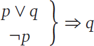
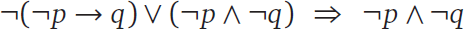

1.2 Propositional Logic
-----------------------

After working through the exercises of the previous section, you may have
noticed a serious limitation of the truth table approach. Each time you add a
new statement to a truth table, you must double the number of rows. This makes
truth table analysis unwieldy for all but the simplest examples.

In this section we will develop a system of rules for manipulating formulas in
symbolic logic. This system, called the propositional calculus, will allow us
to make logical deductions formally. There are at least three reasons for doing
this.

1. These formal methods are useful for analyzing complex logical problems,
especially where truth tables are impractical.
2. The derivation rules we will study are commonly used in mathematical
discourse.
3. The system of derivation rules and proof sequences is a simple example of
mathematical proof.
Of these three, the last is the most important. The mechanical process of
writing proof sequences in propositional calculus will prepare us for writing
more complicated proofs in other areas of mathematics.

1.2.1 Tautologies and Contradictions
````````````````````````````````````

Inquiry 1.4 Explain how the answers to the following two questions are related.
If you pass all the exams, will you pass the course?
Is it possible to pass all the exams and fail the course?
Inquiry 1.5 Consider the following statement.
If you have a ticket, then, as long as you are wearing a shirt, you may enter
the theater, unless you aren’t wearing shoes.
Write a simpler statement that expresses the same policy. Explain how you know
that your statement is equivalent.
Inquiry 1.6 Suppose that a natural number n is gaunt if it satisfies the
following condition.
If n is even, then 10 divides n, and, if n is odd, then 5 divides n.
List the first 6 gaunt numbers. Is there a simpler way to define the condition
of “gauntness”?
There are some statements in formal logic that are always true, no matter what
the T/F values of the component statements are. For example, the truth table
for (p ∧ q) → p is as follows.


Such a statement is called a tautology, and we write

.. figure:: images/dis17-2.png

to indicate this fact. The notation A ⇒ B means that the statement A → B is
true in all cases; in other words, the truth table for A → B is all T’s.
Similarly, the ⇔ symbol denotes a tautology containing the ↔ connective.
Example 1.4 In Exercise 1.1.10 you proved the following tautologies.
(a) ¬(p ∨ q) ⇔ ¬p ∧ ¬q
(b) ¬(p ∧ q) ⇔ ¬p ∨ ¬q
When a tautology is of the form (C ∧ D) ⇒ E, we often prefer to write


instead. This notation highlights the fact that if you know both C and D, then
you can conclude E. The use of the ∧ connective is implicit.
Example 1.5 Use a truth table to prove the following.


Solution: Let S be the statement [p ∧ (p → q)] → q. We construct our truth
table by building up the parts of S, working from inside the parentheses
outward.


Since the column for S is all T’s, this proves that S is a tautology.
◊
The tautology in Example 1.5 is known as modus ponens, which is Latin for
“affirmative mode.” This concept goes back at least as far as the Stoic
philosophers of ancient Greece, who stated it as follows.
If the first, then the second;but the first;therefore the second.
In the exercises, you will have the opportunity to prove a related result
called modus tollens (“denial mode”). In the symbols of logic, this tautology
is as follows.


There are also statements in formal logic that are never true. A statement
whose truth table contains all F’s is called a contradiction.

Example 1.6 Use a truth table to show that p ∧ ¬p is a contradiction.
Solution:
In other words, a statement and its negation can never both be true.
◊
A statement in propositional logic that is neither a tautology nor a
contradiction is called a contingency. A contingency has both T’s and F’s in
its truth table, so its truth is “contingent” on the T/F values of its
component statements. For example, p ∧ q, p ∨ q, and p → q are all
contingencies.

1.2.2 Derivation Rules
``````````````````````

Tautologies are important because they show how one statement may be logically
deduced from another. For example, suppose we know that the following
statements are true.
Our professor does not own a spaceship.If our professor is from Mars, then our
professor owns a spaceship.
We can apply the modus tollens tautology to deduce that “Our professor is not
from Mars.” This is a valid argument, or derivation, that allows us to conclude
this last statement given the first two.

Every tautology can be used as a rule to justify deriving a new statement from
an old one. There are two types of derivation rules: equivalence rules and
inference rules. Equivalence rules describe logical equivalences, while
inference rules describe when a weaker statement can be deduced from a stronger
statement. The equivalence rules given in Table 1.3 could all be checked using
truth tables. If A and B are statements (possibly composed of many other
statements joined by connectives), then the tautology A ⇔ B is another way of
saying that A and B are logically equivalent.2

Table 1.3 Equivalence Rules

An equivalence rule of the form A ⇔ B can do three things:

1. Given A, deduce B.
2. Given B, deduce A.
3. Given a statement containing statement A, deduce the same statement, but
with statement A replaced by statement B.
The third option is a form of substitution. For example, given the following
statement,
If Micah is not sick and Micah is not tired, then Micah can play.
we can deduce the following using De Morgan’s laws.
If it is not the case that Micah is sick or tired, then Micah can play.

In addition to equivalence rules, there are also inference rules for
propositional logic. Unlike equivalence rules, inference rules work in only one
direction. An inference rule of the form A ⇒ B allows you to do only one thing:

1. Given A, deduce B.
Table 1.4 Inference Rules
In other words, you can conclude a weaker statement, B, if you have already
established a stronger statement, A. For example, modus tollens is an inference
rule: the weaker statement B:
Our professor is not from Mars.
follows from the stronger statement A:
Our professor does not own a spaceship, and if our professor is from Mars, then
our professor owns a spaceship.
If A is true, then B must be true, but not vice versa. (Our professor might own
a spaceship and be from Jupiter, for instance.) Table 1.4 lists some useful
inference rules, all of which can be verified using truth tables.

1.2.3 Proof Sequences
`````````````````````

We now have enough tools to derive some new tautologies from old ones. A proof
sequence is a sequence of statements and reasons to justify an assertion of the
form A ⇒ C. The first statement, A, is given.3 The proof sequence can then list
statements B1, B2, B3, …, etc., as long as each new statement can be derived
from a previous statement (or statements) using some derivation rule. Of
course, this sequence of statements must culminate in C, the statement we are
trying to prove, given A.
Example 1.7 Write a proof sequence for the assertion


Solution:
◊
Every time we prove something, we get a new inference rule. The rules in Table
1.4 are enough to get us started, but we should feel free to use proven
assertions in future proofs. For example, the assertion proved in Example 1.7
illustrates the transitive property of the → connective.

Another thing to notice about Example 1.7 is that it was pretty easy—we just
had to apply modus ponens twice. Compare this to the truth table approach: the
truth table for


would consist of eight rows and several columns. Truth tables are easier to do,
but they can be much more tedious.

Proof sequences should remind you of the types of proofs you did in high school
geometry. The rules are simple: start with the given, see what you can deduce,
end with what you are trying to prove. Here’s a harder example.

Example 1.8 Prove:



Solution:
◊
Notice that in step 3 of this proof, we used one of the equivalence rules
(double negation) to make a substitution in the formula. This is allowed: since
¬(¬p) is logically equivalent to p, it can take the place of p in any formula.

1.2.4 Forward–Backward
``````````````````````

If you are having trouble coming up with a proof sequence, try the
‘‘forward–backward” approach: consider statements that are one step forward
from the given, and also statements that are one step backward from the
statement you are trying to prove. Repeat this process, forging a path of
deductions forward from the given and backward from the final statement. If all
goes well, you will discover a way to make these paths meet in the middle. The
next example illustrates this technique.
Example 1.9 In Section 1.1, we used truth tables to show that a statement is
logically equivalent to its contrapositive. In this example we will construct a
proof sequence for one direction of this logical equivalence:


Solution: We apply the forward–backward approach. The only given statement is p
→ q, so we search our derivation rules for something that follows from this
statement. The only candidate is ¬p ∨ q, by the implication rule, so we
tentatively use this as the second step of the proof sequence. Now we consider
the statement we are trying to prove, ¬q → ¬p, and we look backward for a
statement from which this statement follows. Since implication is an
equivalence rule, we can also use it to move backward to the statement ¬(¬q) ∨
¬p, which we propose as the second-to-last statement of our proof. By moving
forward one step from the given and backward one step from the goal, we have
reduced the task of proving

.. figure:: images/dis22-2.png

to the (hopefully) simpler task of proving


Now it is fairly easy to see how to finish the proof: we can switch the ∨
statement around using commutativity and simplify using double negation. We can
now write down the proof sequence.
We used the forward–backward approach to move forward from step 1 to step 2,
and again to move backward from step 5 to step 4. Then we connected step 2 to
step 4 with a simple proof sequence.
◊
You may have noticed that in Section 1.1, we proved the stronger statement


using truth tables; the above example proves only the “⇒” direction of this
equivalence. To prove the other direction, we need another proof sequence.
However, in this case, this other proof sequence is easy to write down, because
all of the derivation rules we used were reversible. Implication,
commutativity, and double negation are all equivalence rules, so we could write
down a new proof sequence with the order of the steps reversed, and we would
have a valid proof of the “⇐” direction.


Exercises 1.2
^^^^^^^^^^^^^

1. Use truth tables to establish the modus tollens tautology:


2. Fill in the reasons in the following proof sequence. Make sure you indicate
    which step(s) each derivation rule refers to.
3. Fill in the reasons in the following proof sequence. Make sure you indicate
    which step(s) each derivation rule refers to.
4. Is the proof in Exercise 2 reversible? Why or why not?
5. Is the proof in Exercise 3 reversible? Why or why not?
6. Fill in the reasons in the following proof sequence. Make sure you indicate
    which step(s) each derivation rule refers to.
7. Justify each conclusion with a derivation rule.
    (a) If Joe is artistic, he must also be creative. Joe is not creative.
    Therefore, Joe is not artistic.
    (b) Lingli is both athletic and intelligent. Therefore, Lingli is athletic.
    (c) If Monique is 18 years old, then she may vote. Monique is 18 years old.
        Therefore, Monique may vote.
    (d) Marianne has never been north of Saskatoon or south of Santo Domingo. In
        other words, she has never been north of Saskatoon and she has never been south
        of Santo Domingo.
8. Which derivation rule justifies the following argument?
    If n is a multiple of 4, then n is even. However, n is not even. Therefore, n
    is not a multiple of 4.
9. Let x and y be integers. Given the statement
    x > y or x is odd.
    what statement follows by the implication rule?
10. Let Q be a quadrilateral. Given the statements
    If Q is a rhombus, then Q is a parallelogram.
    Q is not a parallelogram.
    what statement follows by modus tollens?
11. Let x and y be numbers. Simplify the following statement using De Morgan’s
    laws and double negation.
    It is not the case that x is not greater than 3 and y is not found.
12. Write a statement that follows from the statement
    It is sunny and warm today.
    by the simplification rule.
13. Write a statement that follows from the statement
    This soup tastes funny.
    by the addition rule.
14. Recall Exercise 31 of Section 1.1. Suppose that all of the following status
    reports are correct:
      - Processor B is not working and processor C is working.
      - Processor A is working if and only if processor B is working.
      - At least one of the two processors A and B is not working.
    Let ::

      a = “A is working,”
      b = “B is working”
      c = “C is working”

    (a) If you haven’t already done so, write each status report in terms of a, b,
        and c, using the symbols of formal logic.
    (b) How would you justify the conclusion that B is not working? (In other
        words, given the statements in part (a), which derivation rule allows you to
        conclude ¬b?)
    (c) How would you justify the conclusion that C is working?
    (d) Write a proof sequence to conclude that A is not working. (In other words,
        given the statements in part (a), write a proof sequence to conclude ¬a.)
15. Write a proof sequence for the following assertion. Justify each step.


16. Write a proof sequence for the following assertion. Justify each step.


17. Write a proof sequence for the following assertion. Justify each step.


18. Write a proof sequence for the following assertion. Justify one of the
    steps in your proof using the result of Example 1.8.

    .. figure:: images/dis26-4.png

19. Write a proof sequence to establish that p ⇔ p ∧ p is a tautology.
20. Write a proof sequence to establish that p ⇔ p ∨ p is a tautology. (Hint:
    Use De Morgan’s laws and Exercise 19.)
21. Write a proof sequence for the following assertion. Justify each step.



22. Write a proof sequence for the following assertion. Justify each step.


23. Consider the following assertion.

    .. figure:: images/dis26-7.png

    (a) Find a statement that is one step forward from the given.
    (b) Find a statement that is one step backward from the goal. (Use the addition
        rule—in reverse—to find a statement from which the goal will follow.)
    (c) Give a proof sequence for the assertion.
    (d) Is your proof reversible? Why or why not?
24. Use a truth table to show that

    .. figure:: images/dis27-1.png

    is not a tautology. (This example shows that substitution isn’t valid for
    inference rules, in general. Substituting the weaker statement, q, for the
    stronger statement, p, in the expression “¬p” doesn’t work.)
25.
    (a) Fill in the reasons in the following proof sequence. Make sure you indicate
        which step(s) each derivation rule refers to.
    (b) Explain why the proof in part (a) is reversible.
    (c) The proof in part (a) (along with its reverse) establishes the following
        tautology:

        .. figure:: images/dis27-3.png

        Therefore, to prove an assertion of the form A ⇒ B → C, it is sufficient to
        prove

        .. figure:: images/dis27-4.png

        instead. Use this fact to rewrite the tautology

        .. figure:: images/dis27-5.png

        as a tautology of the form

        .. figure:: images/dis27-6.png

        where C does not contain the → connective. (The process of rewriting a
        tautology this way is called the deduction method.)
    (d) Give a proof sequence for the rewritten tautology in part (c).
26. This exercise will lead you through a proof of the distributive property of
    ∧ over ∨. We will prove:

    .. figure:: images/dis28-1.png

    (a) The above assertion is the same as the following:

    .. figure:: images/dis28-2.png

    Why?
    (b) Use the deduction method from Exercise 25(c) to rewrite the tautology from
    part (a).
    (c) Prove your rewritten tautology.
27. Use a truth table to show that (a → b) ∧ (a ∧ ¬b) is a contradiction.
28. Is a → ¬a a contradiction? Why or why not?
